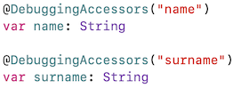
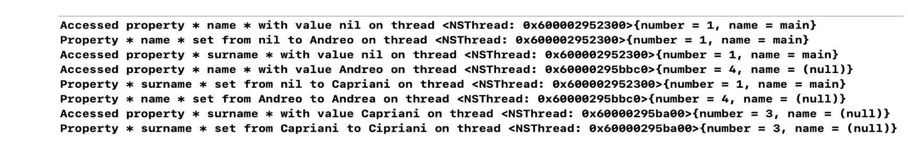

# AGCPropertyDelegates
A collection of Swift property delegates

- `@DebuggingAccessors` | Helps debugging race conditions or unexpected accesses to vars
  -  Prints every access to `get` or `set` of the tagged variable, together with the current thread description
  
  

    
    
  
  
